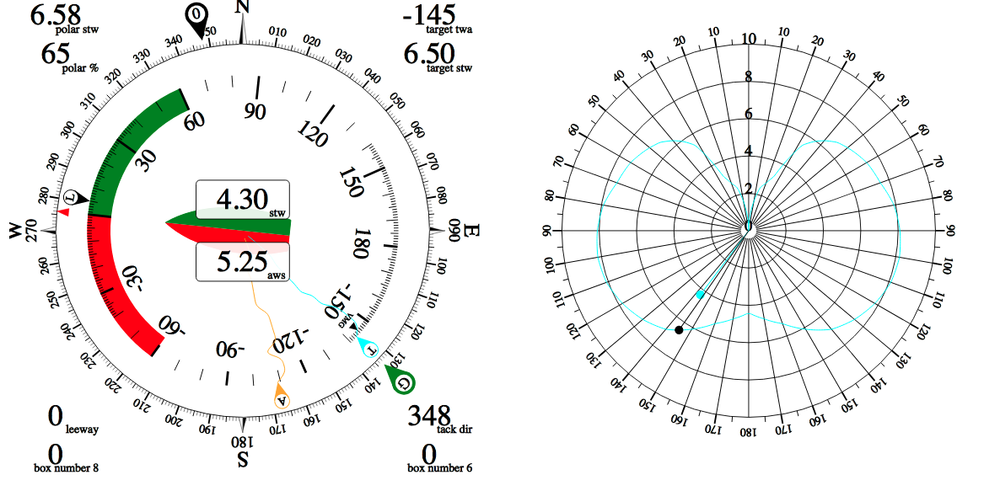

# Sailing Instuments for SignalK

This plugin contains instruments for SignalK designed to run in a browser on a tablet or laptop. The instruments
are specific to sailing rather than motoring and are aimed at helping the helm hit performance targets. 
The majority of stats are calculated in the application itself. Full instruments can be constructed using
components, which self register with a stream of data. At the moment the instument layout is hard coded, but longer
term the plan is to make it all browser configurable.

The outer magnetic heading rose is configured to be north up and has a ground wind direction (G) and a opposite tack (O) direction maker, the values of which are calcualted real time. The outer ring can also be head up. The inner ring is relative the boat also north up or head up, shown in north up mode. It points to the magnetic heading. The L marker marks leeway calculated internally. A is aparent wind angle and T is true wind angle. the small VMG marker is the target twa to achieve maxkimum upwind or downwind VMG based on the polar performance of the boat. This is loaded from a polar file, in json form, currently set to a Pogo 1250. The lines going towards the center are TWA and AWA history. Round the outside various databoxes give speeds, target speeds, polar performance etc. Going up wind the aim is to keep the T marker lined up with the VMG marker, which will give the boat maximum performance and acceleration as it exits a tack and brings AWA forwards.

# Todo

* Polar visualisation (in progress)
* Polar VMG performance, beacause a helm may sail a better VMG in the conditions fast and low that hitting the polar target wind angle and sailing slow.
* Settings
* Grid system
* VMG to Waypoints
* Sail selection on next leg.
