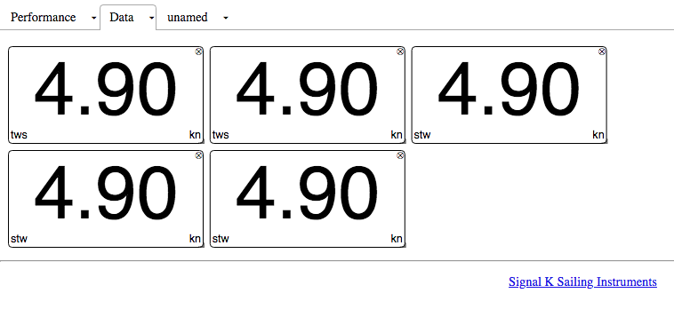
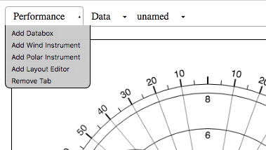

# Sailing Instuments for SignalK

This plugin contains instruments for SignalK designed to run in a browser on a tablet or laptop. The instruments
are specific to sailing rather than motoring and are aimed at helping the helm hit performance targets. 
The majority of stats are calculated in the application itself. Full instruments can be constructed using
components, which self register with a stream of data. At the moment the instument layout is hard coded, but longer
term the plan is to make it all browser configurable.

The outer magnetic heading rose is configured to be north up and has a ground wind direction (G) and a opposite tack (O) direction maker, the values of which are calcualted real time. The outer ring can also be head up. The inner ring is relative the boat also north up or head up, shown in north up mode. It points to the magnetic heading. The L marker marks leeway calculated internally. A is aparent wind angle and T is true wind angle. the small VMG marker is the target twa to achieve maxkimum upwind or downwind VMG based on the polar performance of the boat. This is loaded from a polar file, in json form, currently set to a Pogo 1250. The lines going towards the center are TWA and AWA history. Round the outside various databoxes give speeds, target speeds, polar performance etc. Going up wind the aim is to keep the T marker lined up with the VMG marker, which will give the boat maximum performance and acceleration as it exits a tack and brings AWA forwards.

All the instruments were SVG based, although this resulted in high CPU loads, so they are now HTML5 Canvas elements layerd on top of each other to minimise the CPU load on the bowser and extend battery life as far as possible. With the wind instruments only a few lines are redrawn on each update. 

In addition the layout and settings can be configured. These are currently saved to local storage so survive restarts. A Raw view is available to make changes to aspects that cant be changed in the UI.

# Features

- [X] Basic sailing instrument with magnetic and boat rose, twa,awa,target twa, gwd, next tack, and history.
- [X] Full polar with full set of calculations.
- [X] Polar visualisation, with history of actual performance.
- [X] Settings - allow each component to show a modal settings page.
- [X] Grid system - be able to create a layout with multiple plages without having to change the code.
- [X] Draw VMG performance on the polar, beacause a helm may sail a better VMG in the conditions fast and low that hitting the polar target wind angle and sailing slow. - The polar chart does this for up and downwind. VMG to waypoint might need more info, however the radial lines make it possible to see where the best VMG is to any heading at a specific wind strength.
- [X] Persist layout to local storage, or to a end point - only works when app is loded from a server, state saved locally.
- [X] Convert from SVG to HTML5 Canvas.
- [X] Add Damping, Update rate and IIR filter to every instrument to give smooth output.
- [ ] Add strip chart components.
- [ ] Expand stats capabilities, (standard deviation, moving averages)
- [ ] calculate GWD, leeway and observed current vectors.  HDT with Stw - leeway = course through water, stw, then - current speed + direction in COG/SOG, so its possible to calculate the observed current vectors.
- [ ] Import or input list of waypoints.
- [ ] Visualise sail plan against polar.
- [ ] Calculate TWA, TWS, Polar speed, VMG, tack, vmg, sail selection on each leg.
- [ ] Sail selection on next leg - based on BTW or List of waypoints.
